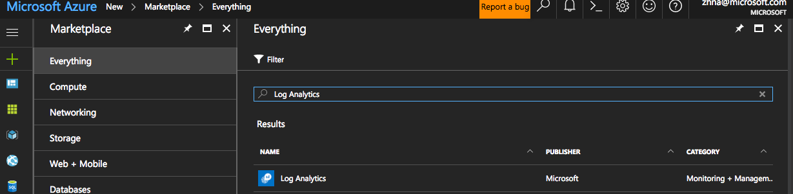
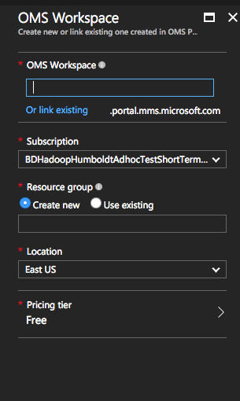
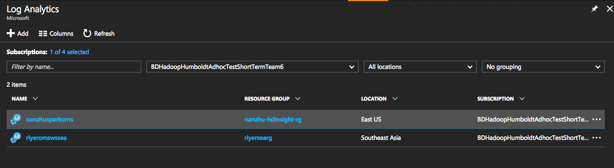
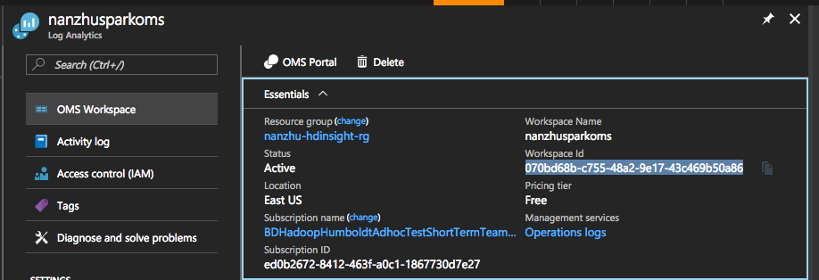
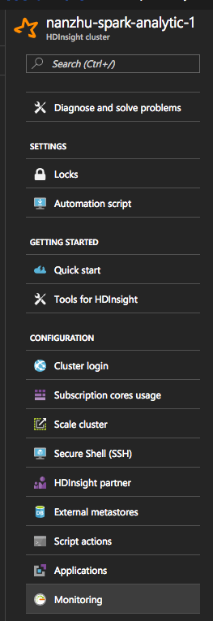
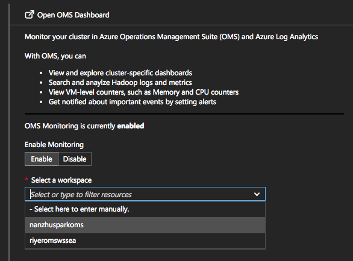

# Monitoring Spark Workload in OMS

## Create Log Analytics Workspace
1. click create `Log Analytics Workspace` in portal

2. Create a `OMS workspace`: fill whatever you like in the following interface

3. Click `Log Analytics`, you will find the current available log analytics workspace in your subscription 
4. Click the `OMS workspace` you just created, and copy and paste the workspace ID to somewhere, and you will use it for later. 

## Install OMS

1. Create a Spark cluster
2. Click `Monitoring` tab in your cluster portal UI 
3. Enable `OMS Monitoring`, and choose the workspace you just created
4. Click Save and you will be fine

## Setup Cluster Passwordless SSH
1. SSH to your headnode
2. Generate ssh key with `ssh-keygen -t rsa`
3. do the following steps for every headnode (including the one you're currently in) and workernode (you can collect IP Address of the nodes through Ambari)
4. `ssh your username@ip_address mkdir -p .ssh`
5. `cat .ssh/id_rsa.pub | ssh username@ip_address 'cat >> .ssh/authorized_keys'`
6. test if passwordless ssh works with `ssh username@ip_address`
7. save IP addresses of all your headnode in a file named "headnodes", and IP addresses of all your workernodes in a file named "workernodes"

## Make Your Cluster report metrics in a timely manner
1. Go to the Ambari to update Spark metrics setup via https://cluster_name.azurehdinsight.net/#/main/services/SPARK2/configs
2. Click `Advanced spark2-metrics-properties`
3. replace `*.sink.slf4j.period=60` with `*.sink.slf4j.period=1`

## Time to Install Spark Monitoring Scripts of OMS

1. SSH to your headnode
2. git clone the scripts with `git clone https://github.com/CodingCat/HDInsightOMS.git`
3. open start scripts: `cd HDInsightOMS; vi scripts/start-all.sh`
4. replace the workspace ID value in the original script (on [line 6](https://github.com/CodingCat/HDInsightOMS/blob/master/scripts/start-all.sh#L6)) 
5. run the scripts `scripts/start-all.sh ssh_user_name_of_your_cluster`

## Userful Queries to Monitoring

1. Query the overall memory usage: `(TimeGenerated>NOW-12hour) Type = log_sparkappsdriver_metrics_CL jvm "total.used" | measure avg(Value_d) by ClusterName_s interval 1minute`
2. Query the number of tasks running in Executors: `(TimeGenerated>NOW-12hour) Type = log_sparkappsdriver_metrics_CL "threadpool.activeTasks" |measure sum(Value_d) by ClusterName_s interval 1minute`
3. Query the processing latency of Spark Streaming Jobs:`Type=log_sparkappsdriver_metrics_CL Source_s="com.microsoft.spark.streaming.examples.directdstream.WindowingWordCount.StreamingMetrics" "streaming.lastCompletedBatch_processingDelay" | measure avg(Value_d) by Source_s interval 1minute` (you have to replace 'com.microsoft.spark.streaming.examples.directdstream.WindowingWordCount' with your applicaton name, or the value you defined with `spark.metrics.namespace`

4. For other streaming metrics, the following two are the most important ones to get more insights about your streaming applications:

* streaming.lastReceivedBatch_records: the size of the micro batches per number of records
* streaming.waitingBatches: the number of queued up batches

5. you can also import spark_workload.omsview in docs directory to start play with OMS
